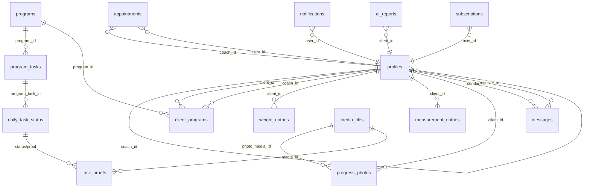

# StepWise Plus V2 - Database Master Schema

Bu doküman StepWise Plus V2 için uzun vadeli veritabanı ana tasarımıdır.

Amaç hemen 100+ tabloyu üretime almak değildir. Amaç; ürün büyürken aynı işi yapan ikinci tablo oluşmasını, eski tabloların kırılmasını ve domainlerin birbirine karışmasını engelleyecek ana veri haritasını netleştirmektir.

## Temel İlkeler

- Mevcut tablolar silinmeyecek.
- Her değişiklik migration ile yapılacak.
- Geriye uyumluluk korunacak.
- Production veri kaynağı Supabase PostgreSQL olacak.
- LocalStorage ve IndexedDB sadece cache, offline draft veya geçici medya kuyruğu olarak kullanılacak.
- RLS her tabloda açık olacak.
- Admin işlemleri doğrudan client tarafından değil Edge Function veya RPC üzerinden yapılacak.
- Service role key hiçbir zaman APK içine girmeyecek.

## Mevcut Tablolar

Bu tablolar şu anda schema içinde bulunuyor ve V2 tasarımında korunacak:

| Tablo | Durum | V2 Kararı |
| --- | --- | --- |
| `profiles` | Mevcut | `users/profiles` domaininin ana tablosu olarak kalır. |
| `coach_codes` | Mevcut | Admin kontrollü koç aktivasyon kodları için kalır. |
| `programs` | Mevcut | Program katalogunun ana tablosu olarak genişler. |
| `program_tasks` | Mevcut | Görev tanımlarının ana tablosu olarak genişler. |
| `client_programs` | Mevcut | Danışan program atama geçmişi için kalır. |
| `body_metrics` | Mevcut | Backward compatible kalır; yeni weight/measurement tablolarına aşamalı ayrılır. |
| `task_logs` | Mevcut | Görev olay geçmişi olarak kalır. |
| `daily_task_status` | Mevcut | Günlük görev state tablosu olarak kalır. |
| `messages` | Mevcut | Mesajlaşma çekirdeği olarak genişler. |
| `appointments` | Mevcut | Randevu çekirdeği olarak genişler. |
| `media_files` | Mevcut | Tüm medya dosyalarının ana metadata tablosu olarak kalır. |
| `notifications` | Mevcut | Basit bildirim inbox tablosu olarak kalır; event tablosu ile genişler. |
| `device_tokens` | Mevcut | Push token yönetimi için kalır. |
| `audit_logs` | Mevcut | Güvenlik ve admin aksiyon kayıtları için kalır. |

## Domain Grupları

V2 database domainleri şu başlıklara ayrılır:

1. Identity & Access
2. Organization & Coach Network
3. Client Profile & Wellness Baseline
4. Programs & Tasks
5. Product Tracking
6. Weight & Measurements
7. Progress Photos & Media
8. Nutrition, Water & Activity
9. Messaging & Communication
10. Calendar & Appointments
11. Notifications & Alarms
12. Reports & Analytics
13. AI Platform
14. Premium, Billing & Payments
15. Admin, Audit & Compliance
16. System, Settings & Observability

## Master Table Catalog

Bu katalog uzun vadeli hedef şemayı tanımlar. `existing` mevcut tabloyu, `extend` mevcut tablo genişlemesini, `new` ise additive migration ile sonradan eklenecek tabloyu ifade eder.

### 1. Identity & Access

| # | Tablo | Durum | Amaç |
| --- | --- | --- | --- |
| 1 | `profiles` | existing | Auth kullanıcısının uygulama profili. |
| 2 | `profile_roles` | new | Gelecekte çoklu rol desteği. |
| 3 | `permissions` | new | Sistem izin katalogu. |
| 4 | `role_permissions` | new | Role göre izin eşlemesi. |
| 5 | `user_consents` | new | KVKK, gizlilik ve kullanım onayları. |
| 6 | `user_sessions` | new | Cihaz ve oturum güvenlik takibi. |
| 7 | `login_events` | new | Başarılı/başarısız giriş logları. |
| 8 | `password_events` | new | Şifre değişimi/sıfırlama güvenlik kayıtları. |
| 9 | `account_recovery_requests` | new | Hesap kurtarma akışları. |
| 10 | `user_devices` | new | Kullanıcı cihaz profili. |

### 2. Organization & Coach Network

| # | Tablo | Durum | Amaç |
| --- | --- | --- | --- |
| 11 | `coach_codes` | existing | Admin tarafından üretilen koç aktivasyon kodları. |
| 12 | `coach_profiles` | new | Koça özel iş profili, uzmanlık, bio. |
| 13 | `coach_client_links` | new | Koç-danışan ilişki geçmişi. |
| 14 | `coach_invites` | new | Danışan davetleri. |
| 15 | `coach_availability` | new | Koç müsaitlik saatleri. |
| 16 | `coach_settings` | new | Koç özel ayarları. |
| 17 | `coach_notes` | new | Koçun danışana yazdığı günlük/özel notlar. |
| 18 | `coach_private_notes` | new | Sadece koçun gördüğü danışan iç notları. |
| 19 | `coach_team_members` | new | İleride ekip/ajans modeli. |
| 20 | `coach_transfer_requests` | new | Danışan koç değişimi talepleri. |

### 3. Client Profile & Wellness Baseline

| # | Tablo | Durum | Amaç |
| --- | --- | --- | --- |
| 21 | `client_profiles` | new | Danışana özel hedef, yaşam tarzı, başlangıç bilgisi. |
| 22 | `client_goals` | new | Kilo verme/alma/koruma hedefleri. |
| 23 | `client_health_flags` | new | Kullanıcının beyan ettiği risk/uyarı alanları. |
| 24 | `client_preferences` | new | Saat, bildirim, tema, iletişim tercihleri. |
| 25 | `client_onboarding_answers` | new | İlk kayıt anket cevapları. |
| 26 | `client_daily_summaries` | new | Günlük özet skorları. |
| 27 | `client_status_events` | new | Aktif, riskli, pasif, tamamladı gibi durum geçmişi. |
| 28 | `client_milestones` | new | 1 kg, 5 kg, 10 kg gibi başarı kilometre taşları. |
| 29 | `client_badges` | new | Rozet ve seviye kazanımları. |
| 30 | `badge_progress` | new | Rozet ilerleme sayaçları. |

### 4. Programs & Tasks

| # | Tablo | Durum | Amaç |
| --- | --- | --- | --- |
| 31 | `programs` | existing | Sistem/koç programları. |
| 32 | `program_tasks` | existing | Program görev tanımları. |
| 33 | `client_programs` | existing | Danışana atanmış programlar. |
| 34 | `program_versions` | new | Program değişiklik geçmişi. |
| 35 | `program_categories` | new | Kilo verme, kilo alma, koruma gibi kategoriler. |
| 36 | `program_task_rules` | new | 3 gün atomlu / 2 gün atomsuz gibi döngü kuralları. |
| 37 | `program_task_products` | new | Görev ile ürün eşlemesi. |
| 38 | `program_task_measurements` | new | Görev içindeki ölçü/kaşık/kapak talimatları. |
| 39 | `program_banned_items` | new | Program bazlı yasaklı liste. |
| 40 | `task_logs` | existing | Görev olay geçmişi. |
| 41 | `daily_task_status` | existing | Günlük görev tamamlanma durumu. |
| 42 | `task_proofs` | new | Görev fotoğraf/ses/video kanıt review modeli. |
| 43 | `task_snoozes` | new | Erteleme hakkı ve kullanım geçmişi. |
| 44 | `task_alarm_plans` | new | Cihazda kurulacak alarm planlarının cloud karşılığı. |
| 45 | `task_reset_events` | new | Günlük görev reset kayıtları. |

### 5. Product Tracking

| # | Tablo | Durum | Amaç |
| --- | --- | --- | --- |
| 46 | `products` | new | Marka bağımsız ürün katalogu. |
| 47 | `product_brands` | new | Herbalife ve ileride başka markalar. |
| 48 | `product_categories` | new | Shake, aloe, çay, fiber, vitamin vb. |
| 49 | `product_units` | new | Kapak, tatlı kaşığı, çay kaşığı, ölçek vb. |
| 50 | `product_unit_conversions` | new | Birim dönüşüm kuralları. |
| 51 | `product_media` | new | Ürün fotoğraf/video varlıkları. |
| 52 | `product_usage_logs` | new | Danışanın ürün kullanım geçmişi. |
| 53 | `product_stock_logs` | new | İleride stok/bitme takibi. |
| 54 | `product_reminders` | new | Ürün kullanım hatırlatmaları. |
| 55 | `product_recommendations` | new | Koç/AI önerileri. |

### 6. Weight & Measurements

| # | Tablo | Durum | Amaç |
| --- | --- | --- | --- |
| 56 | `body_metrics` | existing | Backward compatible beden verisi. |
| 57 | `weight_entries` | new | Tarihsel kilo kayıtları. |
| 58 | `measurement_entries` | new | Bel, kalça, göğüs, kol, bacak vb. ölçümler. |
| 59 | `body_composition_entries` | new | Yağ, kas, su, BMI, metabolik yaş. |
| 60 | `target_weight_plans` | new | Hedef kilo ve hedef tarih planı. |
| 61 | `weight_milestone_events` | new | Kilo başarı mesajlarının kaynağı. |
| 62 | `measurement_milestone_events` | new | Ölçü değişimi başarıları. |
| 63 | `coach_weight_reviews` | new | Koçun kilo verisini onaylama/notlandırma kayıtları. |
| 64 | `scale_photo_reviews` | new | Tartı fotoğraf review ve AI doğrulama sonuçları. |
| 65 | `progress_logs` | new | Kilo, ölçüm, foto ve görevleri birleştiren timeline. |

### 7. Progress Photos & Media

| # | Tablo | Durum | Amaç |
| --- | --- | --- | --- |
| 66 | `media_files` | existing | Tüm dosya metadata ana tablosu. |
| 67 | `progress_photos` | new | Ön/sonra ve periyodik gelişim fotoğrafları. |
| 68 | `profile_photos` | new | Profil fotoğraf geçmişi ve kilit durumu. |
| 69 | `media_thumbnails` | new | Thumbnail ve poster görselleri. |
| 70 | `media_upload_jobs` | new | Offline upload/retry kuyruğu. |
| 71 | `media_access_logs` | new | Hassas medya erişim logları. |
| 72 | `media_retention_rules` | new | Video 7 gün görünür, taslak kalır gibi kurallar. |
| 73 | `media_ai_analyses` | new | AI vision medya analiz çıktıları. |
| 74 | `media_flags` | new | Uygunsuz/bozuk medya işaretleri. |
| 75 | `media_share_links` | new | Gelecekte güvenli paylaşım linkleri. |

### 8. Nutrition, Water & Activity

| # | Tablo | Durum | Amaç |
| --- | --- | --- | --- |
| 76 | `nutrition_logs` | new | Öğün kayıtları. |
| 77 | `meal_items` | new | Öğün içindeki gıda/ürün satırları. |
| 78 | `meal_photos` | new | Yemek fotoğrafları. |
| 79 | `nutrition_ai_estimates` | new | Kalori/makro AI tahminleri. |
| 80 | `water_logs` | new | Su tüketimi. |
| 81 | `water_goals` | new | Günlük su hedefleri. |
| 82 | `activity_logs` | new | Yürüyüş, egzersiz, spor kaydı. |
| 83 | `activity_goals` | new | Günlük/haftalık aktivite hedefleri. |
| 84 | `sleep_logs` | new | İleride uyku takibi. |
| 85 | `habit_logs` | new | Wellness alışkanlıkları. |

### 9. Messaging & Communication

| # | Tablo | Durum | Amaç |
| --- | --- | --- | --- |
| 86 | `messages` | existing | Koç-danışan ve sistem mesajları. |
| 87 | `message_threads` | new | Konuşma başlığı ve participant yönetimi. |
| 88 | `message_participants` | new | Thread katılımcıları. |
| 89 | `message_receipts` | new | Okundu/teslim edildi durumu. |
| 90 | `message_attachments` | new | Mesaja bağlı medya. |
| 91 | `message_reactions` | new | İleride hızlı reaksiyonlar. |
| 92 | `message_moderation_logs` | new | Admin/güvenlik denetim kayıtları. |
| 93 | `coach_broadcasts` | new | Koçun çoklu danışana duyuruları. |
| 94 | `client_announcements` | new | Danışan özet ekranı duyuru kartları. |
| 95 | `communication_settings` | new | Sohbet açık/kapalı ve sessiz ayarlar. |

### 10. Calendar & Appointments

| # | Tablo | Durum | Amaç |
| --- | --- | --- | --- |
| 96 | `appointments` | existing | Randevu ana tablosu. |
| 97 | `appointment_slots` | new | Koçun açtığı saat slotları. |
| 98 | `appointment_requests` | new | Danışan randevu talepleri. |
| 99 | `appointment_proposals` | new | Koçun alternatif saat önerileri. |
| 100 | `appointment_reminders` | new | Randevu hatırlatma planları. |
| 101 | `appointment_notes` | new | Seans notları. |
| 102 | `appointment_outcomes` | new | Görüşme sonucu ve aksiyonlar. |
| 103 | `coach_calendar_blocks` | new | Koçun kapalı saatleri. |
| 104 | `calendar_sync_events` | new | İleride Google/Outlook sync kayıtları. |
| 105 | `session_feedback` | new | Görüşme sonrası geri bildirim. |

### 11. Notifications & Alarms

| # | Tablo | Durum | Amaç |
| --- | --- | --- | --- |
| 106 | `notifications` | existing | Kullanıcı bildirim inbox. |
| 107 | `device_tokens` | existing | Push cihaz tokenları. |
| 108 | `notification_events` | new | Entity/action bazlı bildirim eventleri. |
| 109 | `notification_preferences` | new | Kullanıcı bildirim tercihleri. |
| 110 | `push_delivery_logs` | new | FCM gönderim sonuçları. |
| 111 | `alarm_schedules` | new | Offline alarm planları. |
| 112 | `alarm_firings` | new | Alarm çalma geçmişi. |
| 113 | `alarm_acknowledgements` | new | Kullanıcı alarmı gördü/erteledi/tamamladı. |
| 114 | `reminder_templates` | new | AI/manual hatırlatma metin şablonları. |
| 115 | `reminder_jobs` | new | Planlanmış hatırlatma işleri. |

### 12. Reports & Analytics

| # | Tablo | Durum | Amaç |
| --- | --- | --- | --- |
| 116 | `reports` | new | Sistem rapor ana tablosu. |
| 117 | `report_snapshots` | new | Günlük/haftalık/aylık snapshot verileri. |
| 118 | `coach_dashboard_metrics` | new | Koç dashboard özet metrikleri. |
| 119 | `client_dashboard_metrics` | new | Danışan özet metrikleri. |
| 120 | `compliance_scores` | new | Uyum skor geçmişi. |
| 121 | `risk_scores` | new | Riskli danışan skorları. |
| 122 | `leaderboard_entries` | new | Aylık başarı sıralaması. |
| 123 | `analytics_events` | new | Ürün kullanım analytics eventleri. |
| 124 | `funnel_events` | new | Kayıt, program atama, görev tamamlama funnelı. |
| 125 | `system_health_snapshots` | new | Sistem sağlık metrikleri. |

### 13. AI Platform

| # | Tablo | Durum | Amaç |
| --- | --- | --- | --- |
| 126 | `ai_prompt_library` | new | Merkezi prompt katalogu. |
| 127 | `ai_prompt_versions` | new | Prompt sürüm geçmişi. |
| 128 | `ai_conversations` | new | AI sohbet oturumları. |
| 129 | `ai_messages` | new | AI mesaj kayıtları. |
| 130 | `ai_reports` | new | AI rapor çıktıları. |
| 131 | `ai_nutrition_reviews` | new | Öğün AI yorumları. |
| 132 | `ai_progress_reviews` | new | İlerleme AI yorumları. |
| 133 | `ai_vision_reviews` | new | Fotoğraf/video AI analizleri. |
| 134 | `ai_motivation_events` | new | Motivasyon mesajı üretim kayıtları. |
| 135 | `ai_safety_reviews` | new | Güvenlik ve uygunsuz öneri denetimleri. |
| 136 | `knowledge_documents` | new | AI bilgi tabanı dokümanları. |
| 137 | `document_chunks` | new | RAG doküman parçaları. |
| 138 | `document_embeddings` | new | Vector embedding kayıtları. |
| 139 | `ai_usage_logs` | new | Token/maliyet/kullanım kayıtları. |
| 140 | `ai_model_settings` | new | Model ve feature ayarları. |

### 14. Premium, Billing & Payments

| # | Tablo | Durum | Amaç |
| --- | --- | --- | --- |
| 141 | `premium_plans` | new | Plan katalogu. |
| 142 | `plan_features` | new | Plan özellikleri. |
| 143 | `subscriptions` | new | Kullanıcı abonelikleri. |
| 144 | `subscription_events` | new | Abonelik lifecycle olayları. |
| 145 | `payments` | new | Ödeme kayıtları. |
| 146 | `payment_receipts` | new | Fatura/receipt metadata. |
| 147 | `billing_providers` | new | Google Play, Apple, Stripe vb. |
| 148 | `entitlements` | new | Kullanıcının aktif yetkileri. |
| 149 | `usage_limits` | new | AI, medya, danışan sayısı gibi limitler. |
| 150 | `usage_counters` | new | Limit tüketim sayaçları. |

### 15. Admin, Audit & Compliance

| # | Tablo | Durum | Amaç |
| --- | --- | --- | --- |
| 151 | `audit_logs` | existing | Admin ve güvenlik aksiyon kayıtları. |
| 152 | `admin_actions` | new | Admin operasyonları. |
| 153 | `admin_notes` | new | Admin kullanıcı/support notları. |
| 154 | `support_tickets` | new | Kullanıcı destek talepleri. |
| 155 | `support_messages` | new | Destek yazışmaları. |
| 156 | `security_incidents` | new | Şüpheli durum kayıtları. |
| 157 | `rate_limit_events` | new | Rate limit ihlalleri. |
| 158 | `data_export_requests` | new | KVKK veri dışa aktarma talepleri. |
| 159 | `data_deletion_requests` | new | Hesap/veri silme talepleri. |
| 160 | `policy_acceptances` | new | Politika kabul kayıtları. |

### 16. System, Settings & Observability

| # | Tablo | Durum | Amaç |
| --- | --- | --- | --- |
| 161 | `app_settings` | new | Global uygulama ayarları. |
| 162 | `feature_flags` | new | Modül/özellik aç-kapat. |
| 163 | `app_versions` | new | APK/AAB sürüm kayıtları. |
| 164 | `release_notes` | new | Sürüm notları. |
| 165 | `client_error_logs` | new | Beyaz ekran/crash client logları. |
| 166 | `edge_function_logs` | new | Backend fonksiyon kayıtları. |
| 167 | `sync_jobs` | new | Cloud/local sync işleri. |
| 168 | `sync_conflicts` | new | Offline conflict kayıtları. |
| 169 | `background_jobs` | new | Planlı backend işleri. |
| 170 | `maintenance_windows` | new | Bakım/servis duyuruları. |

## Kritik İlişkiler

## İlk Migration Sırası

Her migration küçük ve geri alınabilir olmalıdır.

1. `weight_entries`, `measurement_entries`, `progress_photos`, `task_proofs`
2. `products`, `product_brands`, `product_categories`, `product_units`, `program_task_products`
3. `coach_notes`, `client_announcements`, `message_threads`, `message_receipts`
4. `notification_events`, `alarm_schedules`, `alarm_firings`
5. `reports`, `report_snapshots`, `coach_dashboard_metrics`, `client_dashboard_metrics`
6. `ai_prompt_library`, `ai_conversations`, `ai_messages`, `ai_reports`
7. `premium_plans`, `subscriptions`, `payments`, `entitlements`
8. `feature_flags`, `client_error_logs`, `sync_jobs`, `sync_conflicts`

## İlk Production İçin Zorunlu Minimum

Yayın öncesi 170 tablonun tamamı gerekli değildir. İlk production için zorunlu minimum:

- `profiles`
- `coach_codes`
- `programs`
- `program_tasks`
- `client_programs`
- `daily_task_status`
- `task_logs`
- `task_proofs`
- `media_files`
- `messages`
- `message_receipts`
- `appointments`
- `notifications`
- `device_tokens`
- `audit_logs`
- `weight_entries`
- `measurement_entries`
- `progress_photos`
- `coach_notes`
- `notification_events`
- `alarm_schedules`
- `client_error_logs`

## Kabul Kriterleri

- Eski tablolar silinmeden yeni tablolar eklenebilir.
- Her yeni tablo RLS açık gelir.
- Her yeni tablo için index stratejisi tanımlanır.
- Her yeni tablo için owner/coach/client/admin erişim matrisi yazılır.
- Migration çalışmadan önce staging veya local Supabase üzerinde denenir.
- Frontend önce read adapter ile geriye uyumlu çalışır.
- Production APK içinde secret bulunmaz.

## Not

Bu dosya migration dosyası değildir. Bu dosya veritabanı yön haritasıdır. Migration dosyaları bu dokümandan küçük, kontrollü ve sprint bazlı çıkarılacaktır.
