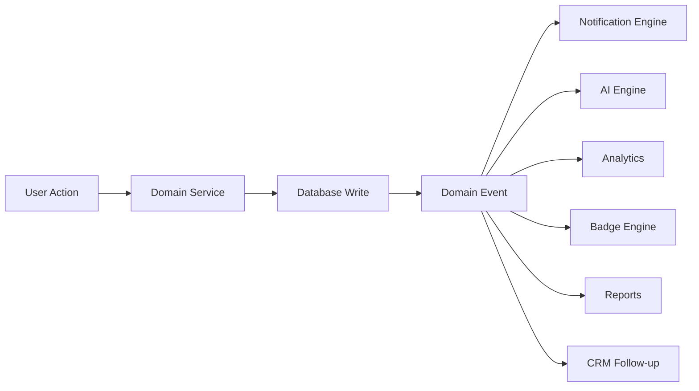

# StepWise Plus V2 - Platform Systems Master Specification

Bu doküman StepWise Plus V2'nin altyapı sistemlerini tanımlar.

Kapsam:

- Offline mode
- Sync engine
- Cache strategy
- Storage strategy
- Search
- Filter
- Import/export
- Notification engine
- Scheduler
- Permission matrix
- Feature flags
- Logging
- Monitoring
- Telemetry
- Multi-tenant architecture
- Event Driven Architecture

## Platform Principles

- Supabase PostgreSQL production source of truth olur.
- Cihaz local verisi cache/offline draft olarak kalır.
- Her kritik kullanıcı aksiyonu domain event üretir.
- Notification, AI, Analytics, Badges, Reports, CRM ve Scheduler doğrudan UI aksiyonuna değil eventlere bağlanır.
- Multi-tenant tasarım en baştan desteklenir.

## Offline Mode

Offline mode uygulamanın internet yokken tamamen kapanmaması için tasarlanır.

### Offline Çalışacak İşlemler

- Görev görüntüleme
- Görev alarmı
- Görev tamamlama draft
- Fotoğraf/ses/video kuyruğa alma
- Kilo/ölçüm draft kaydı
- Mesaj taslağı yazma
- Profil görüntüleme
- Program görüntüleme

### Offline Çalışmayacak İşlemler

- Yeni hesap oluşturma
- Admin yetkili işlem
- Koç aktivasyon kodu üretme
- Payment doğrulama
- AI çağrısı

### Offline UI Kuralları

- Küçük ve sakin offline banner gösterilir.
- Kullanıcı korkutulmaz.
- “Bağlantı gelince senkronize edilecek” dili kullanılır.
- Offline kaydedilen her şey görünür durum etiketi taşır.

## Sync Engine

Sync engine cloud/local veri tutarlılığını yönetir.

### Sync Kuyrukları

- `profile_update_queue`
- `task_completion_queue`
- `media_upload_queue`
- `message_send_queue`
- `weight_entry_queue`
- `measurement_entry_queue`
- `appointment_request_queue`

### Sync Status

| Durum | Anlam |
| --- | --- |
| `draft` | Lokal oluşturuldu, cloud'a gitmedi. |
| `queued` | Gönderim bekliyor. |
| `syncing` | Gönderiliyor. |
| `synced` | Cloud ile eşleşti. |
| `failed` | Gönderim başarısız. |
| `conflict` | Cloud/local çakıştı. |

### Conflict Resolution

Varsayılan kurallar:

- Profil: son güncelleme kazanır, eski değer audit’e düşer.
- Görev: aynı gün aynı görev bir kez tamamlanır.
- Fotoğraf: duplicate medya hash ile engellenir.
- Mesaj: client temp id ile idempotent gönderilir.
- Kilo/ölçüm: aynı timestamp ve aynı değer duplicate sayılır.
- Admin aksiyonu: local offline yapılamaz.

## Cache Strategy

### Cache Katmanları

- Memory cache: ekranda anlık veri.
- LocalStorage: küçük metadata ve session.
- IndexedDB: medya, offline queue, büyük draft.
- Supabase: source of truth.

### Cache Edilecek Veriler

- Kullanıcı profili
- Aktif program
- Günlük görevler
- Son mesaj preview
- Bildirim sayacı
- Avatar thumbnail
- Ürün katalogu
- Koç danışan listesi kısa özet

### Cache Edilmeyecek Veriler

- Service role secret
- Firebase service account
- Payment token
- Admin kritik aksiyon response
- Uzun süreli signed URL

### Cache Invalidation

- Login değişirse tüm user scoped cache temizlenir.
- Program atanırsa task cache yenilenir.
- Görev tamamlanırsa dashboard cache invalid olur.
- Mesaj gelirse thread preview cache yenilenir.
- Profil fotoğrafı değişirse avatar cache yenilenir.

## Storage Strategy

Ana storage: Supabase Storage private bucket `stepwise-media`.

### Bucket Path Standardı

```text
tenants/{tenantId}/users/{userId}/profile/{mediaId}.jpg
tenants/{tenantId}/clients/{clientId}/task-proofs/{yyyy}/{mm}/{mediaId}.jpg
tenants/{tenantId}/clients/{clientId}/progress-photos/{yyyy}/{mm}/{mediaId}.jpg
tenants/{tenantId}/clients/{clientId}/messages/{threadId}/{mediaId}.jpg
tenants/{tenantId}/programs/{programId}/videos/{mediaId}.mp4
tenants/{tenantId}/products/{productId}/images/{mediaId}.jpg
```

### Media Metadata

Her medya kaydı:

- `owner_id`
- `client_id`
- `tenant_id`
- `media_type`
- `storage_bucket`
- `storage_path`
- `mime_type`
- `size_bytes`
- `width`
- `height`
- `duration_seconds`
- `checksum`
- `thumbnail_path`
- `created_at`

### Thumbnail Kuralları

- Avatar: 128x128
- Liste görseli: 320px genişlik
- Preview: 720px genişlik
- Video poster: 480px genişlik

### Retention

- Profil fotoğrafı: kalıcı
- Görev kanıtı: kalıcı, silme admin/policy ile
- Ürün videosu: koçta taslak kalır, danışanda 7 gün görünür
- Mesaj medyası: policy’ye göre saklanır
- AI input medyası: orijinal medya üzerinden analiz edilir, kopya tutulmaz

## Search Engine

### Global Search

Aranacak alanlar:

- Danışan adı
- Koç adı
- Program adı
- Ürün adı
- Randevu
- Mesaj preview
- Rapor

### Domain Search

- Danışan arama
- Program arama
- Ürün arama
- Mesaj içinde arama
- Admin kullanıcı arama

### Search Kuralları

- Mobilde debounce: 250-350ms.
- Minimum karakter: 2.
- Role ve tenant sınırları korunur.
- Sensitive alanlar search index’e alınmaz.

## Filter System

Tek tip filtre modeli:

```js
{
  query: "",
  status: [],
  dateRange: { from: null, to: null },
  sortBy: "created_at",
  sortDirection: "desc",
  tags: [],
  ownerId: null
}
```

Filtre UI:

- Search input
- Segmented control
- Chip filters
- Date range picker
- Sort sheet

## Export System

Export tipleri:

- PDF
- CSV
- Excel

Export edilecek domainler:

- Danışan ilerleme raporu
- Kilo/ölçüm geçmişi
- Görev uyum raporu
- Koç danışan listesi
- Admin audit log
- Payment/subscription raporu

Kurallar:

- Export role permission ister.
- Büyük export backend job olur.
- Export dosyası signed URL ile verilir.

## Import System

Import tipleri:

- CSV
- Excel
- JSON backup

Import domainleri:

- Danışan listesi
- Program listesi
- Ürün katalogu
- Eski uygulama workspace backup

Kurallar:

- Dry-run preview zorunlu.
- Hatalı satırlar raporlanır.
- Duplicate policy seçilir.
- Admin import audit log üretir.

## Notification Engine

Notification sadece “bildirim gönder” kodu değildir; bir senaryo motorudur.

### Bildirim Tipleri

- Görev hatırlatma
- Alarm gecikti
- Görev tamamlandı
- Fotoğraf onay bekliyor
- Fotoğraf onaylandı/reddedildi
- Mesaj geldi
- Randevu talebi
- Randevu onaylandı
- Program atandı
- Kilo milestone
- AI risk uyarısı
- Premium/ödeme bildirimi

### Notification Channels

- In-app inbox
- Push notification
- Local Android alarm notification
- Email ileride
- SMS/WhatsApp ileride opsiyonel

### Kurallar

- Mesaj bildiriminde gönderen danışan adı görünür.
- Koç dashboard aksiyonları mesaj bildiriminden ayrı tutulur.
- Bildirim okundu, kapatıldı ve aksiyon alındı durumları ayrıdır.

## Scheduler

Scheduler arka planda çalışan işleri tanımlar.

### Job Tipleri

- Günlük görev reset
- Alarm plan yenileme
- Signed URL yenileme
- Video görünürlük süresi kontrolü
- Haftalık rapor üretimi
- Aylık leaderboard hesaplama
- AI rapor job
- Subscription status sync
- Push retry
- Media cleanup

### Job Durumları

- `pending`
- `running`
- `completed`
- `failed`
- `retrying`
- `cancelled`

## Permission Matrix

| Kaynak | Admin | Coach | Client | Moderator |
| --- | --- | --- | --- | --- |
| Kendi profilini görme | Evet | Evet | Evet | Evet |
| Tüm kullanıcıları görme | Evet | Hayır | Hayır | Kısıtlı |
| Kendi danışanlarını görme | Evet | Evet | Hayır | Kısıtlı |
| Program oluşturma | Evet | Evet | Hayır | Hayır |
| Program atama | Evet | Evet | Hayır | Hayır |
| Görev tamamlama | Hayır | Hayır | Evet | Hayır |
| Görev kanıtı onaylama | Evet | Evet | Hayır | Kısıtlı |
| Mesaj gönderme | Evet | Evet | Evet | Kısıtlı |
| Rapor görme | Evet | Kendi danışanı | Kendi raporu | Kısıtlı |
| Admin kodu üretme | Evet | Hayır | Hayır | Hayır |
| Ban/aktif yapma | Evet | Hayır | Hayır | Kısıtlı |
| Payment görme | Evet | Kendi hesabı | Kendi hesabı | Hayır |

## Feature Flags

Feature flag tipleri:

- `public`
- `beta`
- `premium`
- `admin_only`
- `tenant_enabled`
- `hidden`

Örnek flagler:

- `ai_coach_enabled`
- `ai_vision_enabled`
- `premium_enabled`
- `coach_group_chat_enabled`
- `marketplace_enabled`
- `community_enabled`
- `dark_mode_enabled`
- `exports_enabled`

## Logging

Log seviyeleri:

- `debug`
- `info`
- `warn`
- `error`
- `security`

Log kaynakları:

- Client app
- Edge Function
- Supabase trigger
- Android native alarm
- FCM receiver
- Scheduler job

Her log:

- timestamp
- user_id
- tenant_id
- role
- module
- action
- severity
- metadata

içermelidir.

## Monitoring

Monitoring alanları:

- Crash
- White screen
- API latency
- Edge Function error
- Supabase query latency
- Push delivery success
- Alarm delivery health
- Media upload failure
- Sync queue backlog
- AI cost/token usage

## Telemetry

Telemetry kullanıcı davranışını ürün geliştirme için ölçer.

Event örnekleri:

- `screen_viewed`
- `task_completed`
- `program_assigned`
- `message_sent`
- `appointment_requested`
- `weight_added`
- `photo_uploaded`
- `ai_report_viewed`
- `premium_clicked`

Kurallar:

- Kişisel hassas içerik telemetry payload’a yazılmaz.
- Tenant ve role bazlı anonimleştirme desteklenir.
- KVKK/onay mekanizması gözetilir.

## Multi-Tenant Architecture

StepWise Plus ileride Herbalife dışındaki ekipler tarafından da kullanılabilir.

### Tenant Modeli

Tenant bir organizasyon, ekip veya marka alanıdır.

Örnek tenantlar:

- Herbalife ekipleri
- Amway ekipleri
- FitLine ekipleri
- USANA ekipleri
- Bağımsız wellness ekipleri

### Multi-Tenant Gereksinimleri

- Her tenant kendi koçlarını ve danışanlarını görür.
- Ürün katalogu tenant bazlı veya global olabilir.
- Program şablonları global, tenant veya coach scoped olabilir.
- Branding tenant bazlı değişebilir.
- Feature flags tenant bazlı çalışabilir.
- Analytics tenant bazlı ayrılır.

### Zorunlu Kolonlar

Uzun vadede çoğu domain tablosu şu alanları taşır:

- `tenant_id`
- `created_by`
- `updated_by`
- `created_at`
- `updated_at`

### Tenant İzolasyon Kuralı

RLS her sorguda tenant sınırını zorunlu tutar.

## Event Driven Architecture

StepWise Plus V2'nin ölçeklenebilirliği event-driven omurga ile sağlanır.

UI bir işlem yapar, domain service veriyi yazar, ardından event üretilir. AI, notification, analytics, badge, report ve CRM modülleri bu eventleri dinler.

### Ana Event Akışı



### Event Envelope

```json
{
  "id": "evt_...",
  "type": "TaskCompleted",
  "tenantId": "tenant_...",
  "actorId": "user_...",
  "subjectId": "client_...",
  "entityType": "daily_task_status",
  "entityId": "uuid",
  "occurredAt": "2026-07-21T12:00:00Z",
  "payload": {},
  "metadata": {
    "source": "mobile",
    "version": 1
  }
}
```

### Core Events

| Event | Üreten Modül | Dinleyen Modüller |
| --- | --- | --- |
| `UserRegistered` | Auth | Analytics, CRM, Notification |
| `CoachRegistered` | Auth | Admin, Analytics |
| `ClientLinkedToCoach` | Clients | CRM, Notification |
| `ProgramCreated` | Programs | Analytics |
| `ProgramAssigned` | Programs | Notification, Scheduler, Reports |
| `ProgramUpdated` | Programs | Scheduler, Reports |
| `TaskScheduled` | Tasks | Alarm, Notification |
| `TaskCompleted` | Tasks | Badge, Reports, Analytics, AI |
| `TaskMissed` | Tasks | Notification, AI, Coach Dashboard |
| `TaskProofUploaded` | Media/Tasks | Coach Dashboard, Notification |
| `TaskProofApproved` | Coach | Reports, Badge, Notification |
| `WeightAdded` | Weight | Reports, Milestones, AI |
| `MeasurementAdded` | Measurements | Reports, AI |
| `PhotoUploaded` | Media | AI Vision, Reports |
| `ProgressPhotoAdded` | Photos | AI Vision, Reports |
| `ProductTaken` | Products | Reports, AI Nutrition |
| `WaterCompleted` | Water | Badge, Analytics |
| `ActivityLogged` | Activity | Reports, AI |
| `MessageSent` | Messages | Notification, Analytics |
| `MessageRead` | Messages | Analytics |
| `AppointmentRequested` | Calendar | Notification |
| `AppointmentConfirmed` | Calendar | Notification, Scheduler |
| `GoalReached` | Progress | Badge, Motivation, Reports |
| `BadgeEarned` | Gamification | Notification, Analytics |
| `SubscriptionStarted` | Billing | Entitlements, Analytics |
| `SubscriptionRenewed` | Billing | Entitlements |
| `SubscriptionExpired` | Billing | Entitlements, Notification |
| `AIReportGenerated` | AI | Notification, Reports |
| `SecurityIncidentDetected` | Security | Admin, Audit |

### Event Storage

Önerilen tablo: `domain_events`

Alanlar:

- `id`
- `tenant_id`
- `type`
- `actor_id`
- `subject_id`
- `entity_type`
- `entity_id`
- `payload`
- `metadata`
- `occurred_at`
- `processed_at`

Event handler tablosu: `event_handler_runs`

Alanlar:

- `event_id`
- `handler_name`
- `status`
- `attempt_count`
- `last_error`
- `processed_at`

### Idempotency

Her event handler idempotent olmalıdır. Aynı event iki kez işlenirse:

- Çift bildirim gitmemeli.
- Çift rozet verilmemeli.
- Çift rapor satırı oluşmamalı.
- Çift AI maliyeti oluşmamalı.

## Kabul Kriterleri

- Her yeni domain aksiyonu bir event üretir.
- Event üretmeden notification, badge, report veya AI tetiklenmez.
- Offline aksiyonlar sync olduktan sonra event üretir.
- Multi-tenant sınırları tüm query ve eventlerde korunur.
- Sensitive data telemetry payload içine yazılmaz.
- Storage path standardı yeni uploadlarda uygulanır.
- Search/filter/import/export tek tip model üzerinden tasarlanır.
